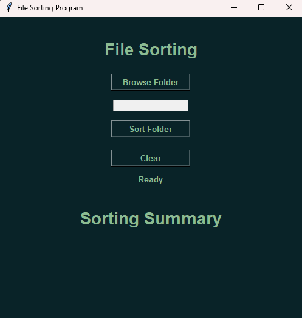
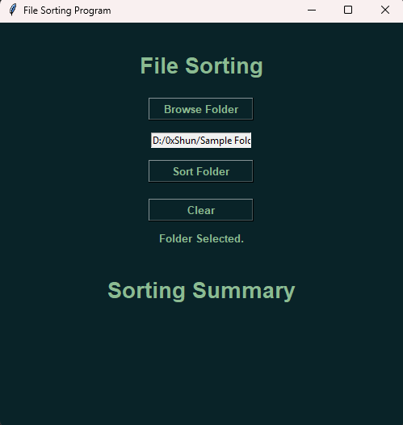
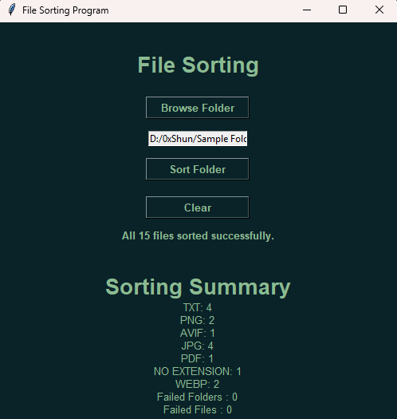

# File Sorter

A Python desktop application that automatically organizes files into folders based on their file extensions.

File Sorter was built as a practical Python automation project to make organizing files faster and easier through a simple graphical interface.

## Features

- Select a folder using a graphical interface
- Automatically organize files by extension
- Create folders automatically when needed
- Handle files without extensions
- Detect and skip duplicate files
- Track successfully sorted and skipped files
- Report files and folders that could not be processed
- Display a sorting summary
- Confirmation prompt before sorting

## Technologies Used

- Python
- Tkinter
- os
- shutil

## How It Works

1. The user selects a folder to sort.
2. The selected folder is displayed below the Browse Folder button.
3. When the user clicks Sort, a confirmation prompt appears to verify the action.
4. Each file is organized into a folder based on its file extension.
5. After sorting, a summary displays the number of files that were successfully sorted, skipped, or failed.

## Screenshots

### Main Interface



### Folder Selected



### Sorting Summary



## Installation

### Option 1: Run from Source


1. Clone this repository.
2. Make sure Python is installed on your computer.
3. Open the project folder in your terminal.
4. Run the application using:

```bash
python file-sorting.py
```

### Option 2: Run the Executable

1. Go to the **Releases** section of this repository.
2. Download `file-sorting.exe` from the latest release.
3. Open the downloaded `.exe` file.
4. File Sorter will launch automatically.